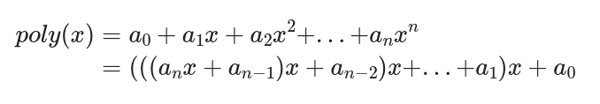

+++
date = '2025-04-10T23:57:57+08:00'
draft = false
title = 'CSAPP:OptimizationLab'

+++

# CSAPP:OptimizationLab

> 本次实验我们来优化一段计算多项式值的代码，并且亲自测量其性能，希望能加深同学们对机器特定优化的理解，同时为同学们提供测量性能的经验。
>
> 基本材料都引用于我校的CSAPP实验指导书页面。

预习：

我们先明确几个概念

## CPE


**处理一个数据元素要多少个时钟周期。**

比如上图，有一个函数对于一个数组的每个元素进行一些重复的操作，那么就可以计算每个元素消耗了多少时钟周期，这就是CPE。

把数组长度n作为自变量，消耗的cycles作为因变量，那么就可以画出一条曲线，曲线的斜率就是CPE。

## Latency bound

**延迟受限**

如下，当存在数据依赖的时候，计算下一次结果时必须等待上一次计算完毕，这个时间没办法减少，就叫latency bound。

那么CPE的下界就是一次浮点乘法运算的时间。

```c
double product(double a[], long n)
{
    long i;
    double x = 1.0;
    for (i = 0; i < n; ++i) {
        x *= a[i];
    }
    return x;
}
```

## Throughput bound

**吞吐受限**

没有依赖的问题，单次进行的用时较短，但是用来并发处理的执行单元较少带来的下界。

## 循环展开

要突破Latency bound到Throughput bound，就要消除数据依赖的问题。

### 2*1展开

消除了分支预测，但是还有数据依赖。

```C
for (i = 0; i < limit; i+=2) {
    x = (x OP d[i]) OP d[i+1];
}
```

### 2*1a展开

这样就使得依赖的路径变短。

```C
for (i = 0; i < limit; i+=2) {
    x = x OP (d[i] OP d[i+1]);
}
```

### 2*2展开

这里有两个累积乘积的变量，能让他们在两条流水线上执行。

```C
for (i = 0; i < limit; i+=2) {
    x0 = x0 OP d[i];
    x1 = x1 OP d[i+1];
}
```

### K*K展开

我们可以用这样比较夸张的展开手法，但是当你用的局部变量过多的时候，寄存器就不够用了，内存读写就会成为新的Bound。

```C
double product(double a[], long n)
{
    long i;
    double acc1 = 1.0;
    double acc2 = 1.0;
    double acc3 = 1.0;
    double acc4 = 1.0;
    double acc5 = 1.0;
    double acc6 = 1.0;
    double acc7 = 1.0;
    double acc8 = 1.0;
    double acc9 = 1.0;
    double acc10 = 1.0;
    for (i = 0; i + 9 < n; i += 10) {
        acc1 *= a[i];
        acc2 *= a[i + 1];
        acc3 *= a[i + 2];
        acc4 *= a[i + 3];
        acc5 *= a[i + 4];
        acc6 *= a[i + 5];
        acc7 *= a[i + 6];
        acc8 *= a[i + 7];
        acc9 *= a[i + 8];
        acc10 *= a[i + 9];
    }
    acc1 *= acc2;
    acc3 *= acc4;
    acc5 *= acc6;
    acc7 *= acc8;
    acc9 *= acc10;
    acc1 *= acc3;
    acc5 *= acc7;
    for (; i < n; ++i) {
        acc9 *= a[i];
    }
    return acc1 * acc5 * acc9;
}
```

## PartA:性能测量实验



```C
void poly(const double a[], double x, long degree, double *result) {
    long i;
    double r = a[degree];
    for (i = degree - 1; i >= 0; i--) {
        r = a[i] + r * x;
    }
    *result = r;
}
```

这是用秦九韶算法实现了求一个函数在某个点处的值的功能。

我想测量这个函数的CPE。

我们能使用的函数有很多，最推荐的是clock_gettime，它可以精确到纳秒级（至少单位是纳秒级），并且可以选取不同的时钟源。

> 注意：在测量这个函数用时多少的时候，最好在一开始首先执行一遍你要测量的函数，这样cache中会存放这些调用时要使用的数据，不会引发大量的cachemiss引入不必要的噪声。

代码很简单：

```C
void measure_time(poly_func_t poly, const double a[], double x, long degree,
                  double *time) {
    double result = 0;
    poly(a, x, degree, &result);
    struct timespec start, end;
    clock_gettime(CLOCK_MONOTONIC, &start);
    poly(a, x, degree, &result);
    clock_gettime(CLOCK_MONOTONIC, &end);
    (*time) = end.tv_nsec - start.tv_nsec;
}
```

## PartB：代码优化实验

> 针对于上面的这个多项式算法，我们有什么优化的方法，我想大概也就是循环展开之类的，来试试看!
>
> 我们的目的是要把这个函数的CPE降低到1。

> 我们根据现有的代码进行了一个更改，对于原函数进行12*12的循环展开。

```C
void poly_optim(const double a[], double x, long degree, double *result) {
 // 此时和秦九公式已经没有关系了，我们想办法最快算出答案即可。
    double acc[12];
    double xpow[13];
    // 记录系数
    acc[0] = a[degree];
    acc[1] = a[degree - 1];
    acc[2] = a[degree - 2];
    acc[3] = a[degree - 3];
    acc[4] = a[degree - 4];
    acc[5] = a[degree - 5];
    acc[6] = a[degree - 6];
    acc[7] = a[degree - 7];
    acc[8] = a[degree - 8];
    acc[9] = a[degree - 9];
    acc[10] = a[degree - 10];
    acc[11] = a[degree - 11];
    // 使用x的哪些幂
    xpow[2] = x * x;
    xpow[3] = xpow[2] * x;
    xpow[4] = xpow[3] * x;
    xpow[5] = xpow[4] * x;
    xpow[6] = xpow[5] * x;
    xpow[7] = xpow[6] * x;
    xpow[8] = xpow[7] * x;
    xpow[9] = xpow[8] * x;
    xpow[10] = xpow[9] * x;
    xpow[11] = xpow[10] * x;
    xpow[12] = xpow[6] * xpow[6];
    // 从倒数12个开始向前进行累积
   int index = degree - 12;
  //  int index = degree - 10;

    while (index >= 11)
    {
        acc[0] = a[index] + acc[0] * xpow[12];
        acc[1] = a[index - 1] + acc[1] * xpow[12];
        acc[2] = a[index - 2] + acc[2] * xpow[12];
        acc[3] = a[index - 3] + acc[3] * xpow[12];
        acc[4] = a[index - 4] + acc[4] * xpow[12];
        acc[5] = a[index - 5] + acc[5] * xpow[12];
        acc[6] = a[index - 6] + acc[6] * xpow[12];
        acc[7] = a[index - 7] + acc[7] * xpow[12];
        acc[8] = a[index - 8] + acc[8] * xpow[12];
        acc[9] = a[index - 9] + acc[9] * xpow[12];
        acc[10] = a[index - 10] + acc[10] * xpow[12];
        acc[11] = a[index - 11] + acc[11] * xpow[12];
        index -= 12;
 

    }

    // 处理剩下没有计算到的部分
   long remain = (degree + 1) % 12;
    long rest_index = remain;
    double remainValue = 0;
    while (rest_index > 0)
    {
        remainValue *= x;
        remainValue += a[rest_index - 1];
        --rest_index;
    }

    //相当于是一种位移,先把他们之间分开
    double remain1 = acc[0] * xpow[11];
    double remain2 = acc[1] * xpow[10];
    double remain3 = acc[2] * xpow[9];
    double remain4 = acc[3] * xpow[8];
    double remain5 = acc[4] * xpow[7];
    double remain6 = acc[5] * xpow[6];
    double remain7 = acc[6] * xpow[5];
    double remain8 = acc[7] * xpow[4];
    double remain9 = acc[8] * xpow[3];
    double remain10 = acc[9] * xpow[2];
    double remain11 = acc[10] * x + acc[11];
    double mainPart = remain1 + remain2 + remain3 + remain4 + remain5 + remain6 + remain7 + remain8 + remain9 + remain10 + remain11;

    //接着整体向后移位
    index = 0;
    
    //-----------------------------------------------------------------------------------------------------------
    //
    //	这里我有一个惨痛的教训：
    //	我一开始很长时间把下边循环的限制量写成了rest_index,但是rest_index在上面早就减为0,循环不会再继续
    //	而这里对于答案造成的影响本来就非常非常小，导致我认为是上面的乘法和加法的精度上出了问题，于是浪费了很多时间在更改分块大小观察精度上
    //	直到最后才看到这里出了问题：写的代码再多，有时也会犯这样的错误
    //	1.务必起一个好的变量名，让人知道在干嘛，哪怕是简单的程序
    //	2.想清楚自己在写什么东西，如果是限制量，搞清楚它的大小
    //
    //-----------------------------------------------------------------------------------------------------------
    while(index < remain){
        mainPart *= x;
        ++index;
    }
    (*result) = remainValue + mainPart;
} 
  
```

### 思考问题：

> 为什么这样更改这个函数的CPE就是1？我就是自己随便想一下，你可以把你的见解放在评论区，说实话我也想不清楚......

1.如果使用 poly() 同时计算多项式在两个x处的值，运行时间如何？14个值呢？需要计算 14 个值时，使用一次 poly() 同时计算快，还是调用14次 poly_optim() 快？

```C
void poly(const double a[], double x[], long degree, double result[], int n) {
    long i;
    double r[n];
    memset(r, a[degree]);
    
    for (i = degree - 1; i >= 0; i--) {
        r[0] = a[i] + r[0] * x;
        r[1] = a[i] + r[1] * x;
    }
    
    for (int index = 0; index < n; ++index){
        result[index] = r[index];
    }
}
```

Q：可能是把参数作为一个数组传入poly()进行计算，在poly中传入一个x数组，还是只有一个循环的情况下，我们进行计算（大概就是上面这个意思），同时计算两个的时候，应该比调用两次poly计算更快，但没有解决依赖的问题。我觉得在degree比较高的时候，是否还是调用14次函数更快。

2.为什么优化后的函数 CPE 是 1 而不是 0.5，性能瓶颈在哪里?

Q：1.o对于这个函数来说是否已经是理论峰值？

以下是优化生成的汇编代码：

```asm
	.arch armv8-a
	.file	"poly.c"
	.text
	.align	2
	.global	poly_optim
	.type	poly_optim, %function
poly_optim:
.LFB0:
	.cfi_startproc
	stp	d8, d9, [sp, -64]!
	.cfi_def_cfa_offset 64
	.cfi_offset 72, -64
	.cfi_offset 73, -56
	stp	d10, d11, [sp, 16]
	stp	d12, d13, [sp, 32]
	str	d14, [sp, 48]
	.cfi_offset 74, -48
	.cfi_offset 75, -40
	.cfi_offset 76, -32
	.cfi_offset 77, -24
	.cfi_offset 78, -16
	mov	x5, x0
	ldr	d24, [x0, x1, lsl 3]
	add	x0, x0, x1, lsl 3
	ldr	d23, [x0, -8]
	ldr	d22, [x0, -16]
	ldr	d21, [x0, -24]
	ldr	d20, [x0, -32]
	ldr	d19, [x0, -40]
	ldr	d18, [x0, -48]
	ldr	d17, [x0, -56]
	ldr	d16, [x0, -64]
	ldr	d7, [x0, -72]
	ldr	d6, [x0, -80]
	ldr	d5, [x0, -88]
	ldr	d4, [x0, -96]
	ldr	d3, [x0, -104]
	ldr	d26, [x0, -112]
	fmul	d27, d0, d0
	fmul	d28, d27, d0
	fmul	d29, d28, d0
	fmul	d30, d29, d0
	fmul	d31, d30, d0
	fmul	d8, d31, d0
	fmul	d9, d8, d0
	fmul	d10, d9, d0
	fmul	d11, d10, d0
	fmul	d12, d11, d0
	fmul	d13, d12, d0
	fmul	d14, d13, d0
	fmul	d2, d14, d0
	fmul	d1, d2, d0
	sub	w4, w1, #15
	cmp	w4, 13
	ble	.L2
	add	x3, x5, w4, sxtw 3
.L3:
	fmul	d24, d1, d24
	ldr	d25, [x3]
	fadd	d24, d24, d25
	fmul	d23, d1, d23
	ldr	d25, [x3, -8]
	fadd	d23, d23, d25
	fmul	d22, d1, d22
	ldr	d25, [x3, -16]
	fadd	d22, d22, d25
	fmul	d21, d1, d21
	ldr	d25, [x3, -24]
	fadd	d21, d21, d25
	fmul	d20, d1, d20
	ldr	d25, [x3, -32]
	fadd	d20, d20, d25
	fmul	d19, d1, d19
	ldr	d25, [x3, -40]
	fadd	d19, d19, d25
	fmul	d18, d1, d18
	ldr	d25, [x3, -48]
	fadd	d18, d18, d25
	fmul	d17, d1, d17
	ldr	d25, [x3, -56]
	fadd	d17, d17, d25
	fmul	d16, d1, d16
	ldr	d25, [x3, -64]
	fadd	d16, d16, d25
	fmul	d7, d1, d7
	ldr	d25, [x3, -72]
	fadd	d7, d7, d25
	fmul	d6, d1, d6
	ldr	d25, [x3, -80]
	fadd	d6, d6, d25
	fmul	d5, d1, d5
	ldr	d25, [x3, -88]
	fadd	d5, d5, d25
	fmul	d4, d1, d4
	ldr	d25, [x3, -96]
	fadd	d4, d4, d25
	fmul	d3, d1, d3
	ldr	d25, [x3, -104]
	fadd	d3, d3, d25
	fmul	d26, d1, d26
	ldr	d25, [x3, -112]
	fadd	d26, d26, d25
	sub	w4, w4, #15
	sub	x3, x3, #120
	cmp	w4, 13
	bgt	.L3
.L2:
	add	x3, x1, 1
	mov	x1, -8608480567731124088
	movk	x1, 0x8889, lsl 0
	smulh	x1, x3, x1
	add	x1, x1, x3
	asr	x1, x1, 3
	sub	x0, x1, x3, asr 63
	lsl	x1, x0, 4
	sub	x0, x1, x0
	sub	x0, x3, x0
	cmp	x0, 0
	ble	.L8
	mov	x1, x0
	movi	d25, #0
	sub	x3, x5, #8
.L5:
	fmul	d25, d0, d25
	ldr	d1, [x3, x1, lsl 3]
	fadd	d25, d25, d1
	subs	x1, x1, #1
	bne	.L5
.L4:
	fmul	d1, d2, d24
	fmul	d14, d14, d23
	fadd	d1, d1, d14
	fmul	d13, d13, d22
	fadd	d1, d1, d13
	fmul	d12, d12, d21
	fadd	d1, d1, d12
	fmul	d11, d11, d20
	fadd	d1, d1, d11
	fmul	d10, d10, d19
	fadd	d1, d1, d10
	fmul	d9, d9, d18
	fadd	d1, d1, d9
	fmul	d8, d8, d17
	fadd	d1, d1, d8
	fmul	d31, d31, d16
	fadd	d1, d1, d31
	fmul	d30, d30, d7
	fadd	d1, d1, d30
	fmul	d29, d29, d6
	fadd	d1, d1, d29
	fmul	d28, d28, d5
	fadd	d1, d1, d28
	fmul	d27, d27, d4
	fadd	d1, d1, d27
	fmul	d3, d0, d3
	fadd	d3, d3, d26
	fadd	d1, d1, d3
	cmp	x0, 0
	ble	.L6
	mov	w1, 0
.L7:
	fmul	d1, d1, d0
	add	w1, w1, 1
	cmp	w1, w0
	bne	.L7
.L6:
	fadd	d25, d25, d1
	str	d25, [x2]
	ldp	d10, d11, [sp, 16]
	ldp	d12, d13, [sp, 32]
	ldr	d14, [sp, 48]
	ldp	d8, d9, [sp], 64
	.cfi_remember_state
	.cfi_restore 73
	.cfi_restore 72
	.cfi_restore 78
	.cfi_restore 76
	.cfi_restore 77
	.cfi_restore 74
	.cfi_restore 75
	.cfi_def_cfa_offset 0
	ret
.L8:
	.cfi_restore_state
	movi	d25, #0
	b	.L4
	.cfi_endproc
.LFE0:
	.size	poly_optim, .-poly_optim
	.align	2
	.global	measure_time
	.type	measure_time, %function
```

全部都是寄存器操作已经避免了内存读写的开销，我们也没有更多的乘法处理单元？

问题：SIMD化是什么？
