+++
date = '2025-03-12T18:02:43+08:00'
draft = false
title = 'MySQL'
+++

> 本期封面是笔者早期最喜欢的动漫角色之一，《とある科学の超電磁砲》中的长点上机学园的天才少女布束砥信，至今笔者的github头像都是她......

# MySQL

> ​	1.本文仅仅是笔者对于SQL语句的**简单熟悉和复习的笔记**，所以并不会对于更深刻的细节进行考究，也不会介绍怎么安装和配置MySQL的环境以及为什么我们要使用关系型数据库。Linux肯定是最方便的.
>
> ​	2.2025.10.8,为了找实习,我们进行第二次的学习,会深入一些关于SQL的细节问题.
>
> ​	3.**练习,练习,练习**,开始时不要过度依赖图形化工具.这会让你失去手写的能力!

数据库的连接:

```sql
mariadb -q root -p
```

企业--->远程连接.

关系型数据库--->二维表关联.

DBMS--->内置的数据库管理系统.--->一个数据库下存放多张table.

### 语言分类

**DDL Define--->数据库定义语言,数据库,表,字段的创建等.**

**DML Manipulation--->数据库操作语言,数据CRUD.**

**DQL Query--->查询,查询数据记录.**

DCL Control--->控制访问权限问题,其实就是**数据库**的用户权限的问题.

查看当前正在操作的数据库:

```sql
MariaDB [db01]> select database();
```

这里的**database**都可以替换成**schema**.

可以使用一些图形化操作工具.

## 1.Table

创建表：有B格地创建一张表--->创建的时候使用约束.

**字段约束:**

not null--->非空

unique--->数据要唯一

primary key--->主键(**auto_increment** 自动增长)

default--->未指定的情况下有一个默认值

foreign key--->外键约束,两张表建立连接


查看表结构：

```sql
desc <table_name>;
```

```sql
delete:drop table if exists;
```

查看所有表:

```sql
show tables;
```

更高级的,查看当时创建表时候的语句:

```sql
show create table <table_name>;
```

**修改表字段**

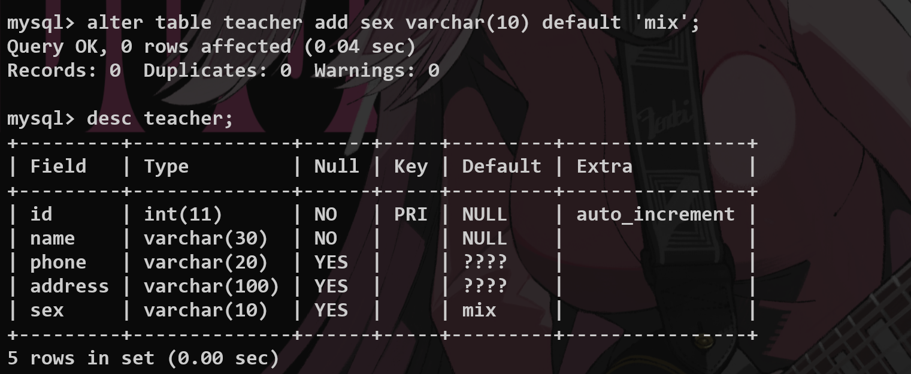

```sql
alter table <name> add(增加字段)/change(修改名称)/modify(修改类型) <name> <name1>……

alter table <name1> rename to <name2>

delete from student;
```

**绝对不要用这样的方式去清空一张表**

1.遍历删除，会浪费时间和资源

2.若设置auto increment 主键，那么再加入数据的时候会从原来增长的部分继续

```sql
truncate table student;
```

直接报废表并且创建一张和原来一样的新表

## 2.Data

DML--->对于数据进行操作.

直接根据字段进行插入:

```sql
insert into teacher values (2, 'Touma', 'Male');
```

你也可以进行**批量**的操作:--->这是**直接针对字段**进行插入的操作.

```sql
insert into teacher (name, sex) values ('Haruki', 'Male'), ('Oi', 'Female');
```

> 1.插入的值和字段一一对应.
>
> 2.字符串和日期包含在引号内部.
>
> 3.插入数据满足约束的要求.

**update** data:

> **没有where就会更新整张表的所有行.**

```sql
update <tablename> set <field> = <newValue> where <field> = <value>;
```

search data from table:

```sql
select <fieldname,…> from <tablename>;

select* from<tablename>
```

**delete**:

```sql
delete from teacher where id = 3;
```

> 还是不要delete from 做所谓的遍历删除.

## 3.DataType

数值类型/字符串类型/时间日期类型

> 针对字段选取合适的数据类型,直接查询就可以.

​	日期 date/date_time--->**每次创建或者更新都要有create_time,update_time,id作为基础字段**,其余自己增加的都是原型字段.

Decimal数据存储原理？--->以字符串的形式来进行存储.

​	decimal(5,2)--->5代表整个数字长度,2代表小数位数的长度.

enum枚举类型：仅能选取其中已经有的 元素来存储，代表从一开始的数字

set集合类型:能从集合中选取多个元素进行存储——用户兴趣标签

set存储原理？？？

## 4.列属性完整性(重点)

> ```sql
> auto_increment 必须是 primarykey主键
> ```
>

### **primary key主键：唯一性	一组或者一个字段**

1.保证数据的**完整性**,和一致性.

2.加快数据的查询速度--->用来做表的关联

```sql
alter table <tablename> add primary key (<filedname>......);
-- 添加主键，多个字段就是组合键

alter table <tablename> drop primary key;
-- 删除主键
```

复合主键解决的问题

unique唯一键

和primary的区别：可以为null，不和其他表产生关联，但是必须唯一（null不唯一）

```sql
alter table <tablename> drop index <filedname>;
```

comment 注释问题

SQL内注释和代码注释

数据库的完整性问题

### **Foreign Key（外键约束技术）**

怎么在**两张表**之间建立联系？

主表：


建立从表：--->创建的语法要注意.

> 这是物理外键:**禁用**,影响效率,容易引发死锁的问题.
>
> 实际开发中我们采用逻辑外键,在业务层面来解决问题.--->交给代码层面来处理?

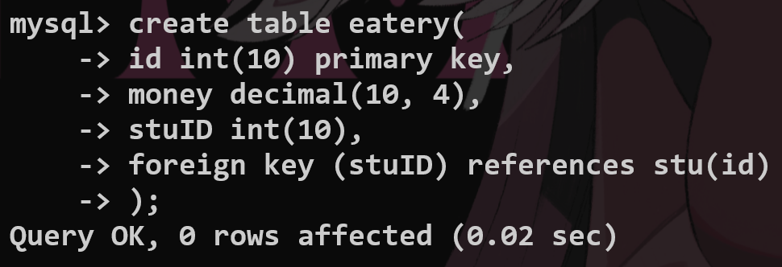

从表：


```sql
alter table <tablename> add foreign key (<filedname>) references <tablename>(<filedname>);

show create table <tablename>;
```

查看创建的表结构并且删除外键

当主表中的数据发生变化的时候，从表中的数据应该如何修改？

## **置空和级联的操作（在创建表的时候就要声明清楚）**

置空：主表中的数据被删除，那么从表中的数据依然保存，但是外键的被删除的字段为NULL；

级联：主表中的数据发生修改，从表中的外键对应字段的数据全部发生修改；


如图：删除——set null


## 5.数据库设计思维

> ​	分析业务模块之间的关系.--->这个设计可能是非常复杂的,我觉得实习生一般不会设计,项目应该会交给DBA?

## a.基本概念

**关系**：两张表通过**共同的字段**来确立**数据的完整性**

**行——一条数据——实体**

**列——一个字段——属性**

**数据冗余**：牺牲空间，提升查询性能（高考总分）

## b.实体之间的关系

一对多(学生表和食堂消费记录之间的关系)

一对一(比如用户和身份信息--->表拆分) 比如加入外键,关联主表的主键,然后把把这个外键设置成unique即可.

多对一(大学选课,建立中间表,建立两个外键关联双方的主键,相当于这个第三方表存放了这些选课的信息)

多对多

## c.范式

Codd第一范式：确保字段的原子性，一个字段不可以再分 2018-2019 —— 2018 2019

Codd第二范式：非键字段必须依赖于主键字段（无关的字段不应当加入，一张表只描述一种信息）

Codd第三范式：消除传递依赖——根据实际情况，我们到底要不要考虑加入数据冗余的处理

## 6.*单表查询

> DQL,查询是SQL的重点问题,因为这也是BS软件操作中最为频繁的.

## a.基本关键字

### select

比如说我们查看一张table的结构并且进行查找:

```sql
desc tb_emp;
select id, username, tb_emp.password from tb_emp;
select * from tb_emp;-- *返回所有的字段(不直观而且性能差(为什么?))
-- SQL解析* 要进行元数据的查找操作
select name as nickname, password as fucking_ps from tb_emp;-- 作为别名来返回
select distinct job from tb_emp;-- distinct去重
```

还有很多其余的用法

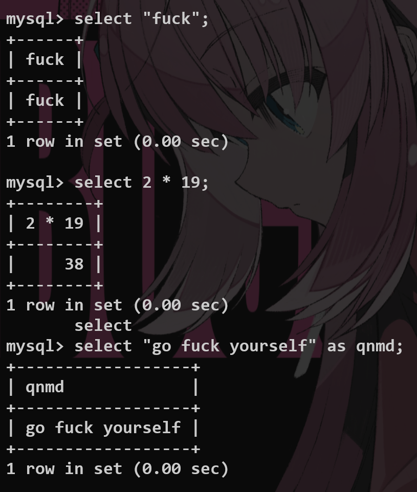

### from

指定要查的表；**返回两张表的笛卡尔积**


### dual

默认的一个**虚拟表，单行单列**

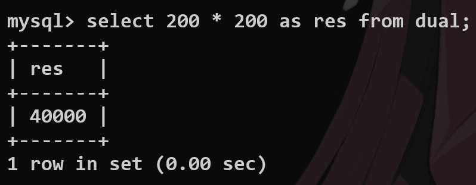

### where

限制select查询条件 < ≤ > ≥ or and……

举几个例子:

```sql
select * from tb_emp where id = 3;
select * from tb_emp where id <= 5;
select * from tb_emp where job is null;-- 判断是否有值 要用is null/ is not null
select * from tb_emp where job is not null;
select * from tb_emp where password != '123456';

select * from tb_emp where entrydate >= '2000-01-01' and entrydate <= '2010-01-01';
select * from tb_emp where entrydate between '2000-01-01' and '2010-01-01';-- 限定日期的范围

select * from tb_emp where job in (2, 3, 4);

select * from tb_emp where name like '__';-- 模糊匹配 _匹配一个字符 %匹配任意字符
select * from tb_emp where name like '张%';
```

### in

限定查询的字段的值在一个范围之内


### **between…and…**

限制查询的范围在给定的闭区间内部


### is null

查看是空或者非空，简单

### *几种常见的聚合函数

**count max min avg sum**

```sql
-- count 1.数量统计 2.count(常量) 3.count(*)
select count(id) from tb_emp;
select count(distinct job) from tb_emp;-- 不重复的工作种类
select count(114514);
select count(*) from tb_emp;-- 推荐使用这个*,底层进行了优化的处理.

-- min max 选取极值
select min(tb_emp.entrydate) from tb_emp;
select max(tb_emp.entrydate) from tb_emp;

select avg(tb_emp.id) from tb_emp;
select sum(id) from tb_emp;
```


> [!TIP]
>
> **Q:select  count(*) and select count(1); **
>
> **what’s the difference?**

### like模糊查询——通配符

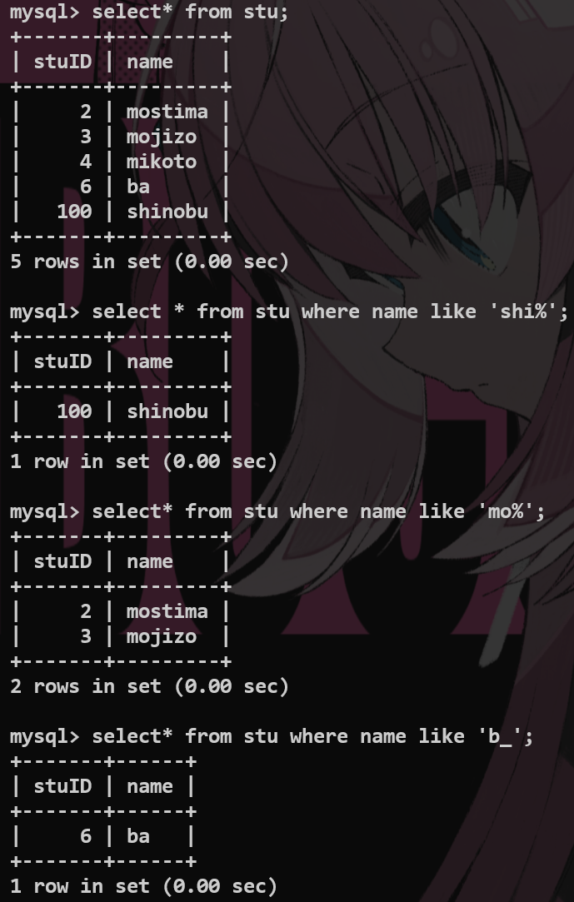

### group by 分组查询

> 不抽象,其实就是根据某个字段来进行分组.
>
> 将某一列数据作为一个整体来进行纵向的计算.

```sql
select <function-name>(<fieldname1>) as 'alias1', <fieldname2> as 'alias2' group by <fieldname2>;-- 要根据哪个字段去查询
```

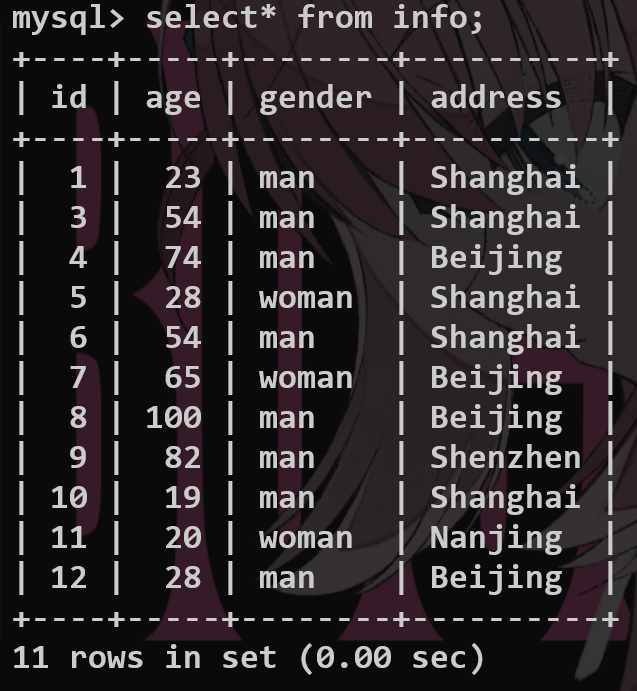

比如想求男性和女性的平均年龄：

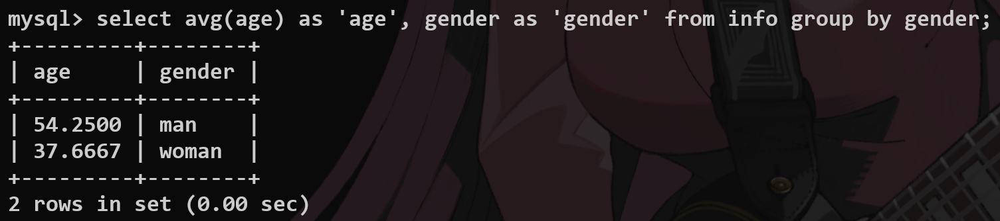

利用group_concat函数查询对应字段对应的实体

进行一些比较复杂的查询:

```sql
select count(*) as 'number' ,tb_emp.gender as 'gender' from tb_emp group by gender;
select job as 'job', count(*) as 'number' from tb_emp where entrydate <= '2015-01-01' group by job having number >= 2;
```

### having

和where一样作为条件筛选，但是：

1.where是根据条件对于实际存在于数据库中的数据进行筛选

> 分组之前where先进行一次过滤,分组之后having再进行过滤.

2.having**对于查询之后的虚拟表使用**——比如配合group_by(此时就不能使用where条件来处理)

> where不能对聚合函数进行作用.

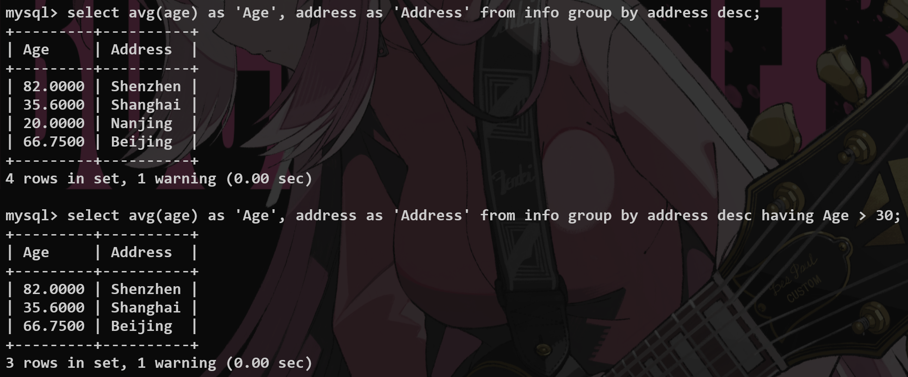

### order by

> 排序的函数.

asc升序,desc降序.

```sql
select * from tb_emp order by entrydate asc, update_time desc;
```

前一个字段的值相同的时候才会进行下一个字段的排序.

### limit

选取顺序中的下标范围

> 比如实现用户界面的分页条,就利用limit来进行查询.--->分页查询.

```sql
select <fieldname> from <tablename> limit <start-index>,<length>;
```


```sql
select * from tb_emp limit 5;-- 忽略起始索引.
select * from tb_emp limit 5, 5;-- 直接计算起始索引,要进行页码的换算.
```

### distinct

去重复关键字

默认情况下有all

```sql
select (all) <fieldname> from <tablename>;
```


至此，单表查询基础结束。

一些组合查询:

> **流程控制函数**,基本查询.

```sql
select * from tb_emp where name like '张%' and gender = 1 and (entrydate >= '2000-01-01' and entrydate <= '2015-12-31') order by update_time desc limit 10;
```

```sql
-- 利用流程函数if来进行展示
select if(tb_emp.gender = 1, 'Male', 'Female') as 'Gender', count(*) as 'Number'
from tb_emp
group by gender;
```

```sql
-- case控制
select case job when 1 then 'Sensei' when 2 then 'Mamiko' when 3 then 'Bro' else 'GOGOGO' end as 'Job',
       count(*) as 'Number'
from tb_emp
group by job;
```

## 7.多表查询

> 就是从多张表中进行连接式的查询.

### 1.union

```sql
select… + union + DISTINCT + select…
```

对应字段个数必须相等

### **2.join**

#### 内连接

这都是内连接的方式:

```sql
-- 这是隐式的内连接
select tb_emp.name, tb_dept.name from tb_emp,tb_dept where tb_emp.dept_id = tb_dept.id;
-- 这是显式的内连接
select tb_emp.name, tb_dept.name from tb_emp inner join tb_dept on tb_emp.dept_id = tb_dept.id;
```

用两个表创建公共字段进行连接——内连接——有多张表就用多个inner进行连接

内连接仅查询共有的数据.


```sql
select f1,f2 from t1 inner join t2 on t1.f3=t2.f4 (having score > 90);
```

left join 以**左表为一个基准**（就算左边没有也要写上去 right join 同理）--->意思就是完全包含左表的数据.

这个意思就是即使左边没有部门,我们也会把这一行给列出来.

你可以直接把这里的左右想象成物理上的左右连接.

```sql
select tb_emp.name as 'empName', tb_dept.name as 'depName' from tb_emp left outer join tb_dept on tb_emp.dept_id = tb_dept.id;
```

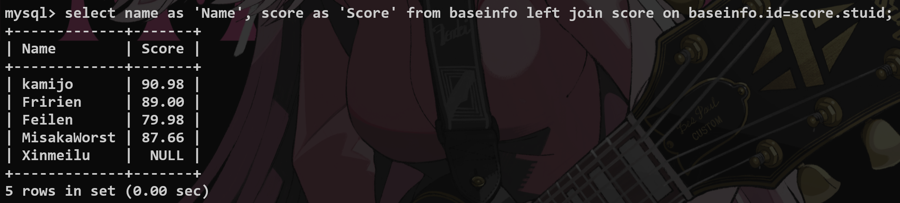

**cross join返回两张表的笛卡尔积**--->增加条件的目的就是消除无效的笛卡尔积.

```sql
select* from t1 cross join t2;
```

natural join自动寻找公共字段并且建立inner join的连接

没有公共字段就返回cross join的结果

using

当两张表的字段完全相同的时候，using指定建立连接的公共字段


## 8.子查询

用一个select语句返回的数据范围作为限制的基准（用in和not in 来控制）

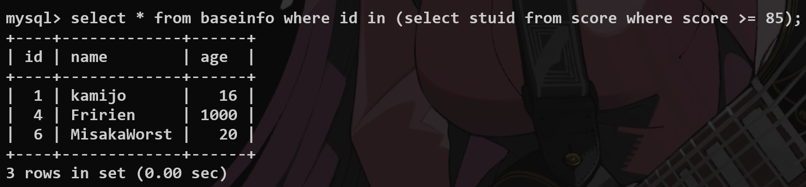

只要存在就全部查询 exists and not exists

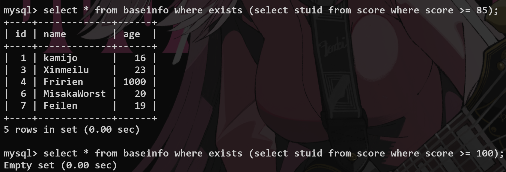

举几个很好的例子:

```sql
-- 子查询
-- 1.标量子查询,查询只会返回一个结果,比如查询一个部门的所有员工(一行一列)
select * from tb_emp where tb_emp.dept_id = (select id from tb_dept where tb_dept.name = '教研部');

-- 2.列子查询,返回一列的数据,in判断是不是在这一列数据内部
select * from tb_emp where dept_id in (select id from tb_dept where name = '教研部' or name = '咨询部');

-- 3.行子查询,返回的是一行的数据,可以有多列,怎么对齐--->查询的时候采用组合字段处理
select * from tb_emp where (entrydate, job) = (select entrydate, job from tb_emp where name = '韦一笑');

-- 4.表子查询,把查询的表作为临时表再次进行查询
select e.name as 'empName', d.name as 'deptName' from (select * from tb_emp where entrydate > '2006-01-01') e, tb_dept d where e.dept_id = d.id;
```

​	至此，所有基础内容结束，以上的内容都是**对于一名实习生**来说最为重要的内容（每一种语法单独看来都是很好理解的，但是都联合起来的话就显得很困难），以下为扩展,但是大厂应该问的比较多.

## *扩展内容：

## 1.视图(View)

作用：简化SQL查询；掩盖敏感数据

创建视图


以后就可以直接查询


alter修改视图

drop直接删除视图

视图底层算法（在使用子查询创建视图的时候）

**unchecked**

1.temp table 临时表算法

2.merge 合并算法

[Q:有什么区别？](https://juejin.cn/post/6963254221449723912)

## 2.事务（Transaction）

处理非常严谨的操作，例如转账等

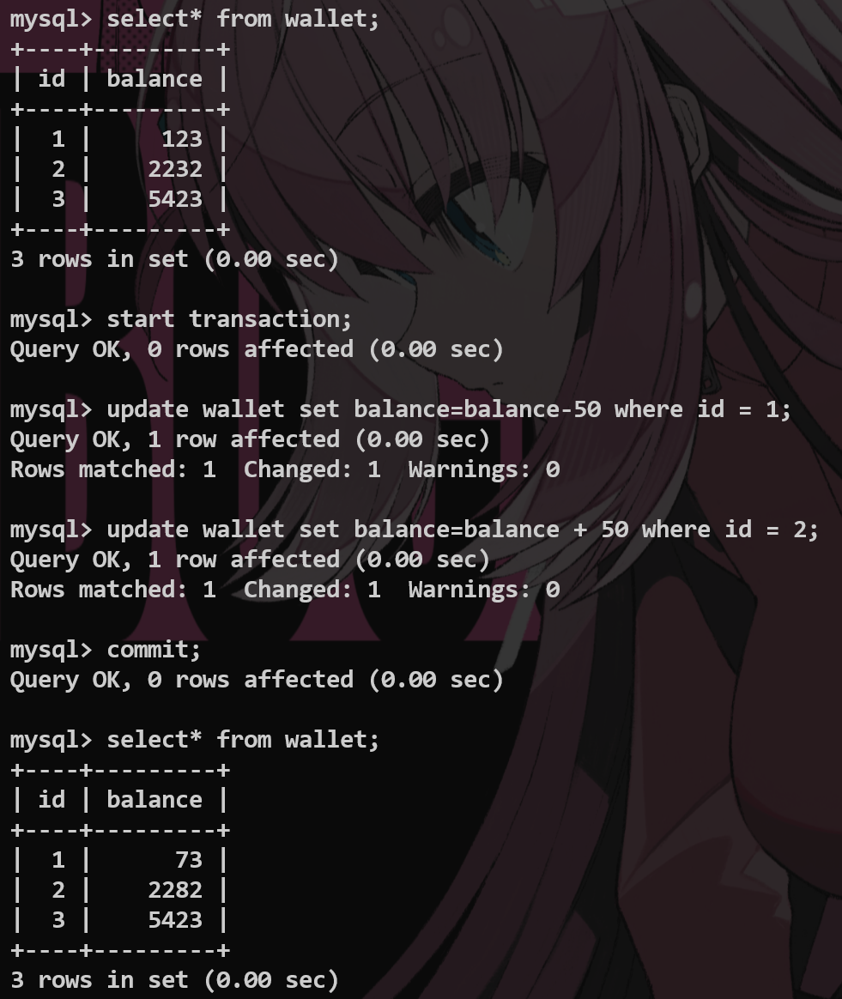

设置回滚点 并且返回—— rollback to


[**事务的ACID特性**](https://zh.wikipedia.org/wiki/ACID)

**Atomicity 原子性：一个事务不可再分，要么全部执行，要么不执行**

**Consistensy 一致性:事务提交之后,数据库的完整性没有被破坏**

**Isolation 隔离性：多个事务同时对一个数据库进行操作，不会产生冲突**

**Duration 持久性:一旦提交,对于数据库的更改是永久的**

**注意：仅当engine=innodb的时候，才能使用事务**

## 3.index（索引）

> 索引的目的就是高效地获取数据.

快速查询数据——**实习生要理解到什么程度**？

没有建立index之前,我们要对于整张表进行扫描才能查找到对应的数据.

遍历整张表,根据索引排列构建一个二叉搜索树,以后在查找的时候,对于这个树进行查找即可.

这样的建立提升了查询和排序的效率.

​	但是建立了这样的树形结构,会占用存储空间,降低了update insert delete的效率.--->要维护数据的索引结构,所以是否要建立要根据表本身的用途.

### 数据结构

> 复习一下基本数据结构.

这里基本都是**B+树**.--->多路平衡搜索树,没那么难.

如果仅有两个节点的话,层数会很深,检索会变慢.

简单的语法:

```sql
-- 创建索引index
create unique index idx_emp_name on tb_emp(name);

-- 查询索引的信息
show index from tb_emp;
-- 创建主键就会自动生成索引--->主键索引,性能是最高的
-- 唯一约束--->唯一索引

-- 怎么删除一个index索引
drop index idx_emp_name on tb_emp;
```


## 4.存储过程

提前写好SQL一次执行，有点像函数

利用delimiter设置结束符号

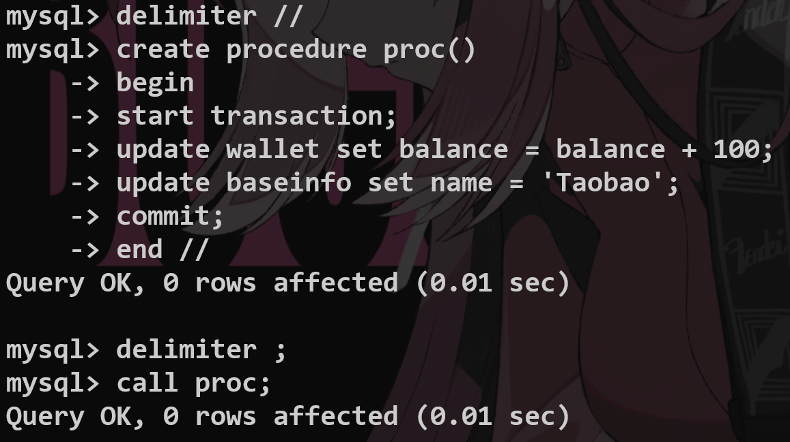

## ***企业规范约束***

---

## 1.库表字段的约束规范

是否： is_vip    unsigned tiny int    length1️⃣ （不能浪费存储）

dont’s

不能有大写字母，

不能以数字开头，

下划线之间不能只有数字，

不能出现负数，

不能有关键字

凡是有小数，必须用decimal数据类型

dos

主键：pk_key，

字符串长度较小时，请使用char，

强制存在的字段：

1.id(unsigned bigint 单表的时候必须自增 primary key) 

2.create_time(datetime) 

3.update_time(datatime),

## 2.索引规范

有某些必须：唯一索引

不能查两个以上的关联查询

varchar上建立索引：建立索引的长度

## 3.SQL开发约束

count(xx,xxx,xx) count(*);

判断为空的方法：

~~where name = null ；~~

where name is null；

不要使用外键和级联（尤其是在高并发的项目中，**牵一发而动全身**）

这些问题在Server层解决

不允许使用存储过程（很难调试，其中的SQL写错了怎么办，和脚本不一样，移植性也很差）

utf-8作为标准编码格式

## 4.其他约束

ORM框架查询不能写*

Q:pujo类(最基础的java类)bool类型不能加is?
